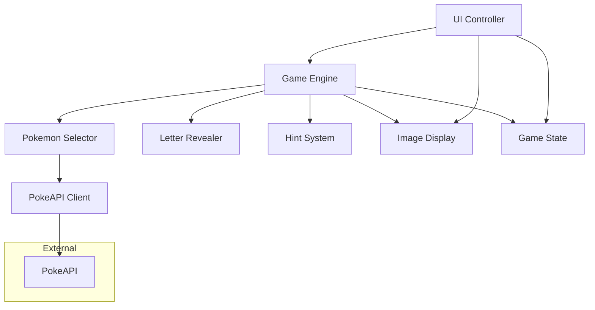

# Design Document: Pokemon Guessing Game

## Overview

The Pokemon Guessing Game is a client-side web application that implements a hangman-style guessing game using Pokemon species names. The application leverages the PokeAPI for dynamic Pokemon data retrieval and provides an engaging user experience through progressive letter revelation, hint systems, and game state management.

The system follows a modular architecture with clear separation of concerns between game logic, API integration, user interface, and state management. All functionality runs entirely in the browser, making it suitable for GitHub Pages deployment without requiring backend infrastructure.

## Architecture

The application follows a Model-View-Controller (MVC) pattern adapted for client-side JavaScript:



### Core Components

1. **Game Engine**: Central orchestrator managing game flow, state transitions, and component coordination
2. **Pokemon Selector**: Handles Pokemon selection logic and API data retrieval
3. **Letter Revealer**: Manages letter guessing mechanics and name revelation
4. **Hint System**: Provides Pokemon clues and manages hint costs
5. **UI Controller**: Handles user interactions and interface updates
6. **Game State**: Maintains current game data and progress
7. **PokeAPI Client**: Manages external API communication and error handling
8. **Image Display**: Manages Pokemon artwork and sprite display at game end

## Components and Interfaces

### Game Engine

The Game Engine serves as the central coordinator for all game operations.

```typescript
interface GameEngine {
  startNewGame(): Promise<void>
  processLetterGuess(letter: string): GuessResult
  requestHint(): HintResult
  getCurrentState(): GameState
  resetGame(): void
}

interface GuessResult {
  isCorrect: boolean
  newlyRevealedPositions: number[]
  gameStatus: 'playing' | 'won' | 'lost'
  remainingGuesses: number
}

interface HintResult {
  hintText: string
  remainingGuesses: number
  gameStatus: 'playing' | 'lost'
}
```

### Pokemon Selector

Handles the complex logic of Pokemon selection from PokeAPI data.

```typescript
interface PokemonSelector {
  selectRandomPokemon(): Promise<PokemonData>
  filterValidPokemon(pokemonList: PokemonReference[]): PokemonReference[]
}

interface PokemonData {
  name: string
  generation: number
  types: string[]
  abilities: string[]
  id: number
  sprites: PokemonSprites
}

interface PokemonSprites {
  other: {
    'official-artwork': {
      front_default: string | null
    }
  }
  front_default: string | null
}


interface PokemonReference {
  name: string
  url: string
}
```

### Letter Revealer

Manages the core guessing mechanics and letter revelation logic.

```typescript
interface LetterRevealer {
  initializeName(pokemonName: string): void
  guessLetter(letter: string): LetterGuessResult
  getRevealedName(): string
  isNameComplete(): boolean
  getGuessedLetters(): GuessedLetters
}

interface LetterGuessResult {
  isCorrect: boolean
  positions: number[]
  alreadyGuessed: boolean
}

interface GuessedLetters {
  correct: string[]
  incorrect: string[]
}
```

### Hint System

Provides Pokemon information as gameplay hints.

```typescript
interface HintSystem {
  initializePokemon(pokemon: PokemonData): void
  generateHint(): string
  hasMoreHints(): boolean
}
```

### Game State

Maintains all current game data and progress tracking.

```typescript
interface GameState {
  currentPokemon: PokemonData | null
  revealedName: string
  guessedLetters: GuessedLetters
  remainingGuesses: number
  gameStatus: 'playing' | 'won' | 'lost'
  hintsUsed: number
}
```

### PokeAPI Client

Handles all external API communication with proper error handling.

```typescript
interface PokeAPIClient {
  getGeneration(generationId: number): Promise<GenerationData>
  getPokemonDetails(pokemonId: number): Promise<PokemonData>
  handleApiError(error: Error): void
}

interface GenerationData {
  pokemonSpecies: PokemonReference[]
}


```

### Image Display

Manages Pokemon artwork and sprite display at game completion.

```typescript
interface ImageDisplay {
  displayPokemonImage(pokemon: PokemonData): void
  getImageUrl(pokemon: PokemonData): string
  handleImageError(): void
}
```


## Data Models

### Pokemon Data Structure

The core data structure representing a Pokemon in the game context, now enhanced with image data:

```typescript
type PokemonData = {
  readonly name: string           // Species name (e.g., "pikachu")
  readonly generation: number     // Generation number (1-9)
  readonly types: readonly string[]     // Pokemon types (e.g., ["electric"])
  readonly abilities: readonly string[] // Ability names
  readonly id: number            // Pokemon ID for API calls
  readonly sprites: PokemonSprites      // Image data for display
}

type PokemonSprites = {
  readonly other: {
    readonly 'official-artwork': {
      readonly front_default: string | null
    }
  }
  readonly front_default: string | null
}


```


### Game State Model

Comprehensive game state tracking:

```typescript
type GameState = {
  readonly currentPokemon: PokemonData | null
  readonly revealedName: string          // Current state of revealed letters
  readonly guessedLetters: {
    readonly correct: readonly string[]
    readonly incorrect: readonly string[]
  }
  readonly remainingGuesses: number      // Starts at 7
  readonly gameStatus: 'playing' | 'won' | 'lost'
  readonly hintsUsed: number
}
```

### API Response Models

Structured representations of PokeAPI responses:

```typescript
type GenerationResponse = {
  readonly pokemon_species: readonly {
    readonly name: string
    readonly url: string
  }[]
}

type PokemonResponse = {
  readonly name: string
  readonly id: number
  readonly types: readonly {
    readonly type: {
      readonly name: string
    }
  }[]
  readonly abilities: readonly {
    readonly ability: {
      readonly name: string
    }
  }[]
  readonly sprites: {
    readonly front_default: string | null
    readonly other: {
      readonly 'official-artwork': {
        readonly front_default: string | null
      }
    }
  }
}
```

## Error Handling

The system implements comprehensive error handling for network issues and API failures:

1. **Network Timeouts**: Retry logic with exponential backoff
2. **API Unavailability**: Graceful degradation with user notification
3. **Malformed Responses**: Data validation and fallback mechanisms
4. **Rate Limiting**: Request throttling and queue management

## Testing Strategy

The testing approach combines unit tests for specific functionality with property-based tests for comprehensive validation of game logic.

### Unit Testing Focus
- API response parsing and validation
- Edge cases in Pokemon name filtering
- Game state transitions for specific scenarios
- Error handling for network failures
- UI component behavior for user interactions

### Property-Based Testing Focus
- Universal properties that must hold across all valid game states
- Comprehensive input validation across randomized test cases
- Game logic consistency across different Pokemon selections
- State management integrity throughout game sessions

**Testing Configuration:**
- Property tests run with minimum 100 iterations for thorough coverage
- Each property test references its corresponding design document property
- Test tags follow format: **Feature: pokemon-guessing-game, Property {number}: {property_text}**
- Both unit and property tests are essential for comprehensive coverage

## Correctness Properties

*A property is a characteristic or behavior that should hold true across all valid executions of a system—essentially, a formal statement about what the system should do. Properties serve as the bridge between human-readable specifications and machine-verifiable correctness guarantees.*

### Property 1: Generation Selection Range
*For any* new game initialization, the randomly selected generation number should always be between 1 and 9 (inclusive)
**Validates: Requirements 1.1**

### Property 2: Pokemon Name Filtering
*For any* list of Pokemon names, filtering should exclude all names containing non-alphabetic characters and preserve all names containing only alphabetic characters
**Validates: Requirements 1.3**

### Property 3: Random Selection Validity
*For any* non-empty filtered Pokemon list, random selection should always return a Pokemon that exists in that list
**Validates: Requirements 1.4**

### Property 4: Game Initialization State
*For any* new game start, the initial state should have exactly 7 remaining guesses, no guessed letters, and 'playing' status
**Validates: Requirements 2.1**

### Property 5: Guess Counter Behavior
*For any* letter guess, if the letter exists in the Pokemon name (case-insensitive) then the guess counter remains unchanged, otherwise it decreases by exactly 1
**Validates: Requirements 2.2, 2.3**

### Property 6: Game Termination Conditions
*For any* game state, if remaining guesses equals 0 then game status is 'lost', and if all letters are revealed then game status is 'won'
**Validates: Requirements 2.4, 2.5**

### Property 7: Letter Revelation Completeness
*For any* Pokemon name and guessed letter, if the letter exists in the name (case-insensitive), then all instances of that letter should be revealed in their correct positions
**Validates: Requirements 3.1, 3.2**

### Property 8: Duplicate Guess Prevention
*For any* letter that has already been guessed, attempting to guess it again should not change the game state (guess counter, revealed letters, or game status)
**Validates: Requirements 3.4**

### Property 9: Display State Consistency
*For any* game state, the displayed name should show revealed letters in correct positions and blank spaces for unguessed letters, matching the actual guess progress
**Validates: Requirements 3.5, 5.1**

### Property 10: Hint Cost Consistency
*For any* hint request during an active game, the guess counter should decrease by exactly 1, regardless of how many hints have been previously used
**Validates: Requirements 4.1, 4.5**

### Property 11: Hint Content Completeness
*For any* Pokemon with valid data, generated hints should contain the Pokemon's generation number, all types, and all ability names
**Validates: Requirements 4.2**

### Property 12: UI State Accuracy
*For any* game state, the displayed guess counter should match the actual remaining guesses, and displayed guessed letters should include all previously guessed letters categorized correctly
**Validates: Requirements 5.2, 5.4**

### Property 13: Game Completion Display
*For any* completed game (won or lost), the display should show the complete Pokemon name and the correct game outcome
**Validates: Requirements 5.5**

### Property 14: Game Reset Completeness
*For any* game reset operation, the new game state should have no previous guesses, no hints used, 7 remaining guesses, and a newly selected Pokemon
**Validates: Requirements 6.1, 6.4**

### Property 15: Session Independence
*For any* sequence of consecutive games, data from previous games (guesses, hints, Pokemon selection) should not affect the current game state
**Validates: Requirements 6.5**

### Property 16: API Error Handling
*For any* network error or API failure, the system should handle the error gracefully without crashing and provide appropriate user feedback
**Validates: Requirements 8.1, 8.3**

### Property 17: Data Validation Integrity
*For any* API response data, invalid or malformed data should be rejected and not used in game logic, maintaining game state integrity
**Validates: Requirements 8.2, 8.5**

### Property 18: Pokemon Selection Round Trip
*For any* valid Pokemon selected through the API process, retrieving its details should return consistent data that matches the selection criteria (alphabetic name, valid generation)
**Validates: Requirements 1.2, 1.5**

### Property 19: End-Game Image Display
*For any* completed game (won or lost), the UI should display a Pokemon image (official artwork, front_default sprite, or placeholder)
**Validates: Requirements 8.1**

### Property 20: Official Artwork Priority
*For any* Pokemon data with available official artwork, the image display should use the official-artwork sprite URL
**Validates: Requirements 8.2**

### Property 21: Sprite Fallback Behavior
*For any* Pokemon data without official artwork but with front_default sprite, the image display should use the front_default sprite URL
**Validates: Requirements 8.3**

### Property 22: Image Placeholder Handling
*For any* Pokemon data without both official artwork and front_default sprites, the image display should show a placeholder or no-image message
**Validates: Requirements 8.4**